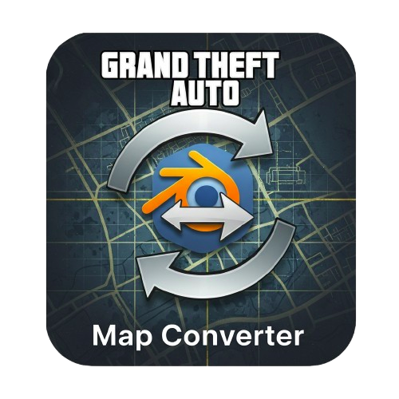

<p align="center">
  
</p>

<h1 align="center">GTA Map Converter</h1>

<p align="center">
  Convert <b>GTA games</b> map files to Blender 2.79-compatible <code>.OBJ</code> files with textures and materials.
</p>

<p align="center">
  
  
  
</p>

---

### 🎬 Features

✅ Convert `.ide`, `.ipl`, `.img`, `.dff`, `.txd` from GTA SA  
✅ Automatically extracts textures and places objects accurately  
✅ Outputs a single, clean `.obj` file compatible with **Blender 2.79**

---

### 💻 Screenshots

| GUI | Preview |
|-----|---------|
|  |  |

---

### 🧩 Requirements

- Python 3.8+
- Linux Mint (or any modern Linux distro)
- [Blender 2.79](https://www.blender.org/download/previous-versions/)

---

### ⚙️ Installation

```bash
git clone https://github.com/null-patch/gta_map_conv.git
cd gta_map_conv
chmod +x install.sh
./install.sh
```

### 💻 Run the app
```bash
source venv/bin/activate
python3 main.py
```
